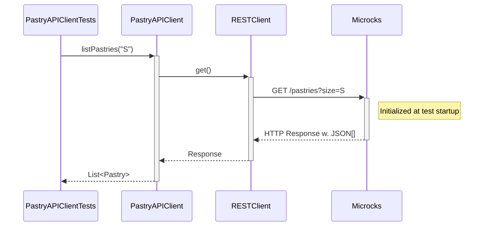
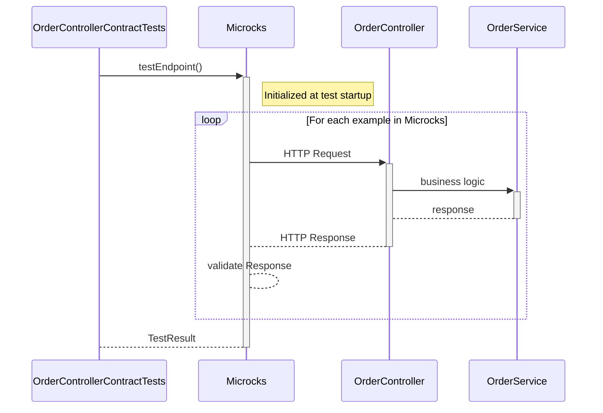

# Step 4: Let's write tests for the REST APIs

So far, we focused on being able to run the application locally without having to install or run any dependent services manually.
But there is nothing more painful than working on a codebase without a comprehensive test suite.

Let's fix that!!

## First Test - Verify our RESTClient

In this section, we'll focus on testing the `Pastry API Client` component of our application:


Let's review the test class `PastryAPIClientTests` under `src/test/java/org/acme/order/client`:

```java

```



## Second Test - Verify the technical conformance of Order Service API

The 2nd thing we want to validate is the conformance of the `Order API` we'll expose to consumers. In this section and the next one,
we'll focus on testing the `OrderResource` component of our application:


The sequence diagram below details the test sequence. Microcks is used as a middleman that actually invokes your API with the example from its dataset:



Our `OrderResource` development is technically correct: all the JSON and HTTP serialization layers have been tested!

## Third Test - Verify the business conformance of Order Service API

The above section allows us to validate the technical conformance but not the business one! Imagine we forgot to record all the
requested products in the order or change the total price in resulting order. This could raise some issues!

Microcks allows to execute business conformance test by leveraging Postman Collection. If you're familiar with Postman Collection
scripts, you'll open the `order-service-postman-collection.json` file and find some snippets like:

```jshelllanguage
pm.test("Correct products and quantities in order", function () {
    var order = pm.response.json();
    var productQuantities = order.productQuantities;
    pm.expect(productQuantities).to.be.an("array");
    pm.expect(productQuantities.length).to.eql(requestProductQuantities.length);
    for (let i=0; i<requestProductQuantities.length; i++) {
        var productQuantity = productQuantities[i];
        var requestProductQuantity = requestProductQuantities[i];
        pm.expect(productQuantity.productName).to.eql(requestProductQuantity.productName);
    }
});
```

This snippet typically describes business constraints telling that a valid order response should have unchanged product and quantities.

You can now validate this from your Java Unit Test as well! Let's review the test class `OrderControllerPostmanContractTests`
under `src/test/java/org/acme/order/api`:

```java

```

Comparing to the code in previous section, the only change here is that we asked Microcks to use a `Postman` runner
for executing our conformance test. What happens under the hood is now that Microcks is re-using the collection snippets
to put some constraints on API response and check their conformance.

The test sequence is exactly the same as in the previous section. The difference here lies in the type of response validation: Microcks
reuses Postman collection constraints.

You're now sure that beyond the technical conformance, the `Order Service` also behaves as expected regarding business
constraints.


### 
[Next](step-5-write-async-tests.md)